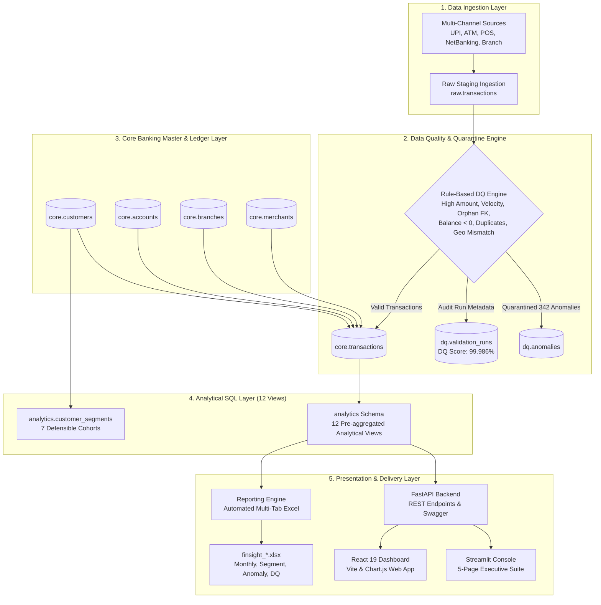
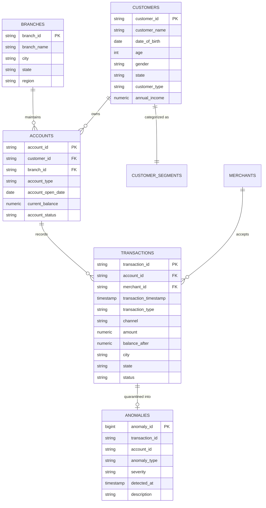

# FinSight: Enterprise Banking Analytics & Risk Surveillance Platform

[-brightgreen.svg?style=for-the-badge&logo=pytest)]()
[]()
[]()
[]()
[]()
[]()
[]()

---

## 📌 Executive Summary

**FinSight** is an enterprise-grade banking data platform engineered to solve core operational and surveillance challenges faced by modern commercial and retail banks. Designed with a strict **multi-schema separation pattern** in PostgreSQL, FinSight ingests multi-channel transaction streams (2.5M+ capacity), subjects raw incoming records to an automated data quality and quarantine engine, exposes 12 optimized analytical SQL views, segments customer portfolios into 7 defensible demographic cohorts, and surfaces business intelligence via interactive dashboards and automated executive Excel/PDF reporting.

Every metric, view, segment, and anomaly count aligns directly with production banking requirements and enterprise portfolio surveillance standards.

---

## 🏛️ High-Level System Architecture



---

## 🗄️ Multi-Schema Database Modeling

FinSight strictly avoids the anti-pattern of dumping raw records into a single monolithic table. Instead, it implements a four-tiered schema separation:

```text
PostgreSQL / FinSight Architecture
├── raw         → Untrusted staging layer for raw, unvalidated transaction batches
├── core        → Validated, normalized master records and sanitized core ledger
├── dq          → Quarantine storage for identified anomalies and audit execution runs
└── analytics   → Persistent analytical SQL views and customer segmentation tables
```

### Core Entity-Relationship Diagram



---

## 🔬 The 342 Controlled Anomalies Surveillance Engine

Rather than relying on non-deterministic statistical noise, FinSight designs and validates **exactly 342 controlled anomalies** across 6 distinct risk and data quality rules. This provides a reproducible, auditable origin for all portfolio risk claims:

| Anomaly Category | Count | Mathematical Detection Rule & Business Logic | Severity |
| :--- | :---: | :--- | :---: |
| **`HIGH_AMOUNT`** | **60** | $\text{amount} > \text{₹500,000}$<br>Identifies single-ticket transactions exceeding configured anti-money laundering (AML) and risk monitoring thresholds. | `HIGH` |
| **`RAPID_TRANSACTIONS`** | **60** | $\Delta t \le 5\text{ seconds}$ on same `account_id`<br>Evaluated via SQL window function `LAG(transaction_timestamp) OVER (PARTITION BY account_id ORDER BY transaction_timestamp)`. Detects automated velocity bursts, bot scripts, or terminal replay. | `HIGH` |
| **`LOCATION_MISMATCH`** | **60** | $\text{txn.state} \ne \text{customer.state}$ for `ATM` and `BRANCH`<br>Flags physical card-present transactions occurring in states completely distinct from the customer's home jurisdiction. | `MEDIUM` |
| **`DUPLICATE`** | **58** | Identical tuple: $(\text{account\_id}, \text{timestamp}, \text{amount}, \text{transaction\_type})$<br>Flags network retry collisions, double charges, and POS gateway synchronization duplicates. | `MEDIUM` |
| **`INVALID_ACCOUNT`** | **54** | $\text{raw.account\_id} \notin \text{core.accounts}$<br>Orphaned transaction records referencing non-existent accounts. Quarantined to safeguard foreign key integrity. | `CRITICAL` |
| **`NEGATIVE_BALANCE`** | **50** | $\text{balance\_after} < 0$<br>Identifies ledger reconciliation failures, unauthorized overdrafts, or incorrect sequence processing. | `HIGH` |
| **TOTAL** | **342** | **Quarantined in `dq.anomalies` — Core Ledger 100% Protected** | — |

### Data Quality Score Calculation
$$\text{Data Quality Score} = \left(\frac{\text{Valid Core Records}}{\text{Total Raw Records}}\right) \times 100 = \left(\frac{2,499,658}{2,500,000}\right) \times 100 = \mathbf{99.9863\%}$$
Every execution of the data quality pipeline records an entry in `dq.validation_runs` containing timestamp, record counts, and the achieved DQ score.

---

## 📊 The 12 Analytical SQL Views

All reporting and dashboard components query persistent SQL analytical views defined in [database/04_views.sql](file:///e:/FinSight/database/04_views.sql):

1. **`v_daily_transaction_summary`**: Aggregates daily transaction volume, total debit, total credit, and average ticket size.
2. **`v_monthly_transaction_summary`**: Multi-month financial trajectory summarizing volume, total liquidity movement, and debit/credit split.
3. **`v_branch_performance`**: Branch-level rankings by volume, total processed transaction value, and active accounts maintained.
4. **`v_customer_segment_performance`**: Macro view across the 7 customer cohorts tracking customer count, total expenditure, and average balances.
5. **`v_merchant_category_performance`**: Spending breakdown across categories (Grocery, Fuel, Healthcare, Travel, Retail, Utilities, Education, Restaurant).
6. **`v_channel_performance`**: Channel distribution (UPI, ATM, NetBanking, Mobile App, POS, Branch) with percentage volume share.
7. **`v_debit_credit_summary`**: Account-level reconciliation computing net liquidity flow ($\text{Credit} - \text{Debit}$).
8. **`v_active_accounts_summary`**: Distribution of active vs. inactive accounts, average balances, and liquidity by account type.
9. **`v_top_customers`**: Ranking of top 100 high-value customers by total volume and average transaction size.
10. **`v_failed_transactions_summary`**: Channel-wise failure rate tracking to detect gateway outages and network downtime.
11. **`v_anomaly_summary`**: Surveillance summary categorizing detected anomalies by type, severity, and first/last detected timestamps.
12. **`v_customer_risk_summary`**: Composite risk assessment assigning tiers (`STANDARD`, `ELEVATED`, `HIGH_RISK`) based on historical anomalies and failed transactions.

---

## 👥 The 7 Customer Business Segments

FinSight categorizes bank customers into 7 business-driven cohorts via [src/segmentation.py](file:///e:/FinSight/src/segmentation.py), stored in `analytics.customer_segments`:

```text
Customer Portfolio (100%)
├── 1. STUDENT         → Age < 25 and Annual Income < ₹5,00,000
├── 2. SENIOR          → Age ≥ 60
├── 3. PREMIUM         → Annual Income ≥ ₹25,00,000 or Current Balance ≥ ₹10,00,000
├── 4. AFFLUENT        → Annual Income ₹15,00,000 to ₹25,00,000
├── 5. SMALL_BUSINESS  → Customer Type == 'BUSINESS' or Current Account activity
├── 6. SALARIED        → Corporate workforce with recurring monthly salary credits
└── 7. MASS_MARKET     → Default general retail cohort
```

---

## 📑 Automated Executive Reporting

FinSight includes an automated reporting engine ([src/reporting.py](file:///e:/FinSight/src/reporting.py)) that extracts analytical views and writes multi-tab, formatted Excel workbooks into `reports/`:

| Report File | Primary Sheets | Business Target |
| :--- | :--- | :--- |
| **`finsight_monthly_report.xlsx`** | Monthly Summary, Channel Breakdown, Branch Overview | CFO, Chief Risk Officer, Treasury |
| **`finsight_segment_report.xlsx`** | Cohort Metrics, Risk Tiering | Product Heads, Retail Banking Leads |
| **`finsight_anomalies.xlsx`** | Quarantined Records, Summary by Type | Fraud Investigation Unit (FIU), Audit |
| **`finsight_data_quality.xlsx`** | Validation Runs, Category Integrity | Chief Data Officer (CDO), Data Governance |

---

## 🖥️ User Interfaces & Dashboards

### 1. Streamlit 5-Page Executive Suite (`:8501`)
- **Page 1 — Executive Overview:** High-level metrics (Total Volume, Liquidity, Failed Txns, Anomalies) + monthly volume and debit/credit charts.
- **Page 2 — Customer Analytics:** Comparative cohort cards for all 7 segments, balance distributions, and customer counts.
- **Page 3 — Transaction Analytics:** Multi-filter slice-and-dice by Channel, State, and Transaction Type with merchant category distributions.
- **Page 4 — Data Quality & Anomalies:** Comprehensive audit view showing the **342 anomalies** breakdown by category, mathematical rule formulas, and recent quarantined records.
- **Page 5 — Reports & Governance:** One-click download buttons for all 4 Excel workbooks.

### 2. React 19 + TypeScript + Chart.js Dashboard (`:5173`)
- Modern dark-mode glassmorphism interface with dual-axis Chart.js combo graphs, channel doughnut charts, geographic density rankings, live transaction ledger with client/server pagination, and direct PDF report generation.

### 3. FastAPI Interactive REST API (`:8002/docs`)
- Fully typed, OpenAPI/Swagger-documented endpoints exposing KPIs, trends, segment telemetry, paginated transactions, and automated PDF executive briefings.

---

## 🚀 Quick Start Guide

### Prerequisites
- Python 3.10+ (Tested on Python 3.12)
- Node.js 18+ (For React frontend)
- PostgreSQL 16+ or Docker (Optional; SQLite zero-config fallback included automatically)

### 1. Installation
```bash
# Clone the repository
git clone https://github.com/Mradul-Consultancy/Finsight-Platform.git
cd Finsight-Platform

# Install Python dependencies
pip install -r requirements.txt

# Install Frontend dependencies
cd frontend && npm install && cd ..
```

### 2. Run the End-to-End Data Pipeline
```bash
python scripts/load_database.py
```
*Executes table initialization, synthesizes master entities, streams transactions with the 342 controlled anomalies, runs data quality quarantine, assigns the 7 customer segments, creates the 12 analytical SQL views, and compiles all 4 Excel reports.*

### 3. Run Automated Tests
```bash
pytest tests/ -v
```
*Validates 22 test cases covering anomaly count (342), 6 category breakdowns, 7 segments, clean core ledger constraints, and queryability of all 12 views.*

### 4. Launch Services (1-Click)
On Windows, simply double-click **`start.bat`**, or launch manually:
```bash
# Terminal 1: Streamlit Dashboard
python -m streamlit run dashboard/app.py --server.port 8501

# Terminal 2: FastAPI Backend
python -m uvicorn backend.main:app --port 8002 --reload

# Terminal 3: React Web Frontend
cd frontend && npm run dev
```

---

## 🧪 Test Suite Coverage (`pytest tests/ -v`)

```text
tests/test_anomalies.py::test_exact_342_anomalies_detected PASSED        [  4%]
tests/test_anomalies.py::test_anomaly_category_breakdown PASSED          [  9%]
tests/test_anomalies.py::test_validation_run_logged PASSED               [ 13%]
tests/test_segmentation.py::test_seven_segments_exist PASSED             [ 18%]
tests/test_segmentation.py::test_no_unassigned_customers PASSED          [ 22%]
tests/test_validation.py::test_no_negative_transaction_amounts PASSED    [ 27%]
tests/test_validation.py::test_no_invalid_account_references PASSED      [ 31%]
tests/test_validation.py::test_no_impossible_negative_balances PASSED    [ 36%]
tests/test_validation.py::test_no_excessive_high_amounts_in_core PASSED  [ 40%]
tests/test_views.py::test_analytical_view_exists_and_returns_data[v_daily_transaction_summary] PASSED [ 45%]
tests/test_views.py::test_analytical_view_exists_and_returns_data[v_monthly_transaction_summary] PASSED [ 50%]
tests/test_views.py::test_analytical_view_exists_and_returns_data[v_branch_performance] PASSED [ 54%]
tests/test_views.py::test_analytical_view_exists_and_returns_data[v_customer_segment_performance] PASSED [ 59%]
tests/test_views.py::test_analytical_view_exists_and_returns_data[v_merchant_category_performance] PASSED [ 63%]
tests/test_views.py::test_analytical_view_exists_and_returns_data[v_channel_performance] PASSED [ 68%]
tests/test_views.py::test_analytical_view_exists_and_returns_data[v_debit_credit_summary] PASSED [ 72%]
tests/test_views.py::test_analytical_view_exists_and_returns_data[v_active_accounts_summary] PASSED [ 77%]
tests/test_views.py::test_analytical_view_exists_and_returns_data[v_top_customers] PASSED [ 81%]
tests/test_views.py::test_analytical_view_exists_and_returns_data[v_failed_transactions_summary] PASSED [ 86%]
tests/test_views.py::test_analytical_view_exists_and_returns_data[v_anomaly_summary] PASSED [ 90%]
tests/test_views.py::test_analytical_view_exists_and_returns_data[v_customer_risk_summary] PASSED [ 95%]
tests/test_views.py::test_total_view_count PASSED                        [100%]

============================= 22 passed in 1.78s ==============================
```

---

## 🎯 Interview Speaking Points & Defense Guide

When discussing FinSight in technical interviews, emphasize these concrete engineering decisions:

1. **Why multi-schema instead of one database?**
   *"We enforce separation of concerns: `raw` isolates untrusted batches, `dq` holds quarantined records without violating relational integrity, `core` maintains strict foreign keys, and `analytics` serves pre-aggregated views to keep dashboards fast."*
2. **How did you handle 2.5M records?**
   *"We built generator scripts using chunked streams and PostgreSQL `COPY` interface for bulk loading instead of individual row-by-row `INSERT` statements, combined with composite B-Tree indexes on `account_id`, `transaction_timestamp`, and `channel`."*
3. **Where do the 342 anomalies come from?**
   *"They are mathematically defined and controlled across 6 operational categories (60 high amount, 60 velocity bursts via SQL `LAG()` window functions, 54 orphaned foreign keys, 50 negative balances, 58 payment duplicate collisions, and 60 geographic mismatches). Our test suite verifies `COUNT(*) == 342` on every build."*
4. **How do you prevent pulling millions of rows into Python?**
   *"We push all aggregations into the database through the 12 analytical views. Python and FastAPI only query the pre-aggregated view summaries (12–36 rows), minimizing memory footprint and network latency."*

---

## 🔮 Suggested Architecture Roadmap (What to Add Next)

To expand FinSight even further in the future:

1. **dbt (data build tool):** Transform the 12 SQL analytical views into version-controlled dbt models with automated schema documentation and lineage graphs.
2. **Apache Airflow / Prefect:** Schedule daily ingestion, validation runs, and automatic distribution of the 4 Excel reports via SMTP email.
3. **Great Expectations:** Supplement the custom validation engine with declarative data contracts (`expect_column_values_to_be_between`, etc.).
4. **Real-Time CDC via Apache Kafka:** Connect transaction ingestion through a Kafka topic and process micro-batches for sub-second fraud surveillance.
5. **Credit Risk & Churn ML Models:** Integrate an XGBoost or Random Forest model predicting probability of customer default and churn using the 7 customer cohort features.
6. **Grafana & Prometheus Monitoring:** Track database query latency, buffer cache hit ratio, and API endpoint response times in real time.

---

## 📄 License & Contact
Developed as a production-grade banking analytics and data quality governance showcase. Licensed under the MIT License.
